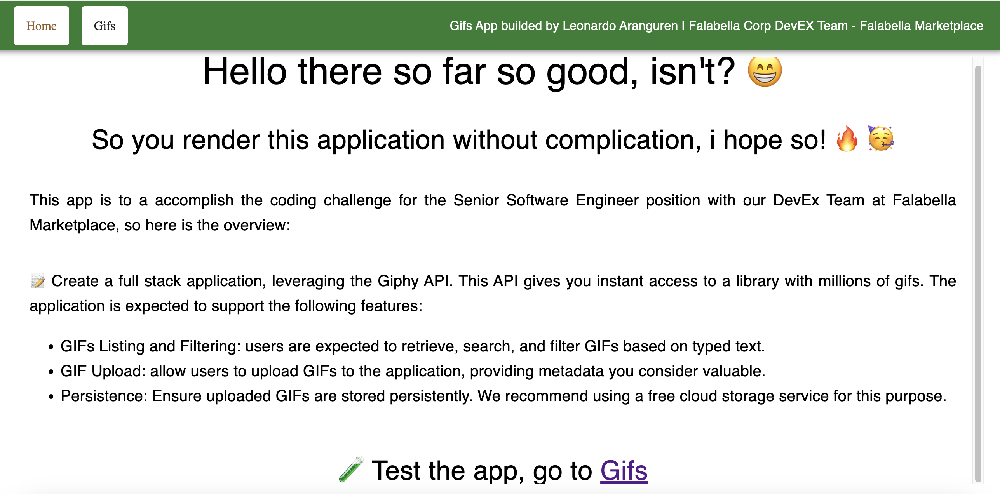
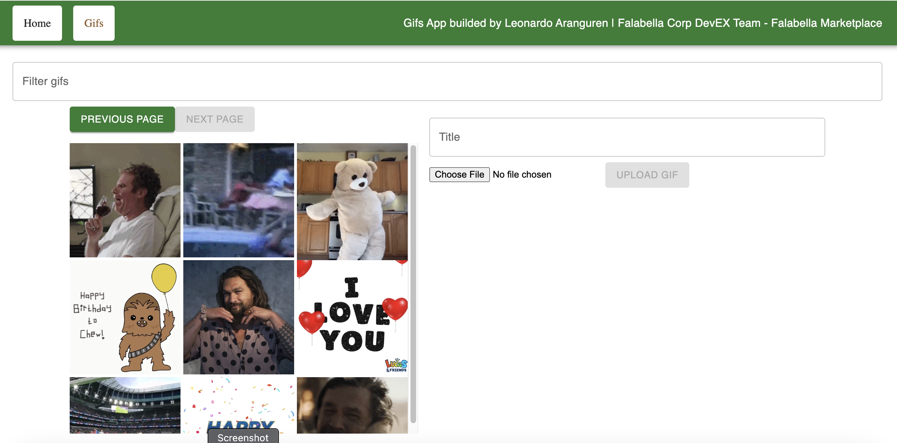

# Falabella Corp DevEx Team Challenge

#### Implementation Details

This app born for the purpose of **Falabella Corp DevEx Team Challenge**, it contains the following technologie stack:

-   Front-End: **React + Typescript**
-   Back-end: **Nestjs**
-   Database: **MongoDB**

##### Highlights

-   The entire solutions use Docker (docker compose) for an easy way of run in any machine
-   The Front-End use **Material UI** for get a nice render views
-   The Back-End use **repository pattern** in case we change the source of data, i.e: SQL.
-   The Mongo container **needs** data for seed, below the steps.

# Steps for running the app

-   Install [ Docker Engine ](https://docs.docker.com/engine/install/) :fire:

#### 1. Generate Seed for MongoDB using Giphy Data

-   Go to `cd mongo-seed` folder, for file **make-gifs-seed** fill up variable `apiKey` (Giphy API Key).
-   Execute `node make-gifs-seed` it generate a file called **gifs-seed.js**.
-   Copy all the content (`Ctrl + A and Ctrl + C`) of **gifs-seed.js**.
-   In file file **init.js** paste it in variable `gifs`.

### 2. Generate .env and .env.development

💡 "You're gonna need have AWS credentials\*\*"

-   In the root **.env.example** have the skeleton for generate the `.env`.
-   In the folder `cd nestjs-app`, exist **.env.example** with the skeleton for generate the **.env.development**.

#### 3. Build the enviroment

-   Build image `docker-compose build`.
-   Run container `docker-compose up -d`.

# How to test it? - Using Jest 🧪

It app have a few unit tests only

-   Go to `cd nestjs-app` folder.
-   `npm install`.
-   `npm run jest`, it gonna execute the basic unit test (gif controller and service).

### Start reading code, interpreting functionalities and programming :smile:

#### Screenshots

**Home Page**

**Gifs Page**

